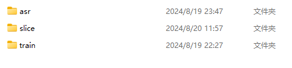
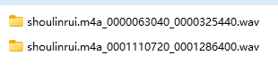
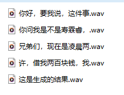
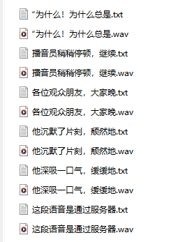

# 安装

#### 1.将autoprocess.py和produce.py放在与webui.py一个层级


#### 2.在该层级创建一个文件夹resources，并在resources里面再创建一个文件夹train，把训练模型的音频放在train文件夹里


#### 3.在train文件夹里再创建一个reference文件夹，把推理的参考音频放在这里，可以使用其他路径，只是为了方便管理


#### 4.查看是否已经下载了需要的模型（这里默认是使用达摩asr）


# 引用示例：

```python
# -*- coding: utf-8 -*-
from autoprocess import autorun,autorun2
from tools.i18n.i18n import I18nAuto, scan_language_list
i18n = I18nAuto()

train_file_name="shoulinrui.m4a"
train=False
gpu="1-2" #多个要-，单个就打数字
reference="resources/slice/shoulinrui.m4a/shoulinrui.m4a_0001110720_0001286400.wav"
text="这段语音是通过服务器上的自动生成函数获得的语音，使用了1和2两张显卡，全中文语言，效果不错"
text_language=i18n("中文")

prompt_text="个性化和移动端订单的增长，让北美门店叫苦不迭"
prompt_language=i18n("中文")

def auto_v1(train_file_name,train,gpu,reference,text,text_language,prompt_text,prompt_language):
    autorun(train_file_name,train,gpu,reference,text,text_language,prompt_text,prompt_language)
    autorun2(train_file_name,train,gpu,reference,text,text_language,prompt_text,prompt_language)

auto_v1(train_file_name,train,gpu,reference,text,text_language,prompt_text,prompt_language)
```

#### 1.设置编码模式+导包

```python
# -*- coding: utf-8 -*-
from autoprocess import autorun,autorun2
from tools.i18n.i18n import I18nAuto, scan_language_list
i18n = I18nAuto()
```

#### 2.设置参数

```python
train_file_name="shoulinrui.m4a"
train=False
gpu="1-2" #多个要-，单个就打数字
reference="resources/slice/shoulinrui.m4a/shoulinrui.m4a_0001110720_0001286400.wav"
text="这段语音是通过服务器上的自动生成函数获得的语音，使用了1和2两张显卡，全中文语言，效果不错"
text_language=i18n("中文")
prompt_text="个性化和移动端订单的增长，让北美门店叫苦不迭"
prompt_language=i18n("中文")
```

参数解释：

- **train_file_name** 字符串 在resources/train文件夹下对应到音频的文件名称
- **train**  布尔 是否要训练模型。True为训练+推理。False为只进行推理
- **gpu** 字符串 使用的gpu号，如果多个，用-连起来，如1-2。如果只有一个，必须输入单个数字，如0
- **reference** 字符串 参考音频的路径（根目录与webui.py同级）
- **text** 字符串 生成语音对应的文本内容
- **prompt_text** 字符串 参考音频对应的文本内容
- **language**	默认使用中文

#### 3.定义函数auto_V1(包含训练+推理)

```
def auto_v1(train_file_name,train,gpu,reference,text,text_language,prompt_text,prompt_language):
    autorun(train_file_name,train,gpu,reference,text,text_language,prompt_text,prompt_language)
    autorun2(train_file_name,train,gpu,reference,text,text_language,prompt_text,prompt_language)
```

#### 4.调用auto_V1进行批量化输出

```
auto_v1(train_file_name,train,gpu,reference,text,text_language,prompt_text,prompt_language)
```

# 文件输出层级

#### resources文件下



train保存训练数据

slice保存经过切割后的训练数据

asr保存切割后的训练数据识别得到的文字list

#### output 文件下

以exp_{训练音频名称}保存的**实验文件夹**


**实验文件夹下**以{参考音频名称}保存的**推理文件夹**



**推理文件夹**下是以{生成语音对应文本}为名称的推理音频



# 更新

8.20 15：05

```python
def slice_auto(folder_path,texts):
    for filename in os.listdir(folder_path):
        file_path=os.path.join(folder_path,filename)
        if filename.endswith(".wav"):
            y,sr=librosa.load(file_path,sr=None)
            duration=librosa.get_duration(y,sr)
            if(duration>3.0 and duration<10.0):
                for text in texts:
                    print(f"{filename}——————3.0<{duration}<10.0——————满足时长")
                    prompt_text=find_text(filename,"resources/asr/shoulinrui.m4a/shoulinrui.m4a.list")
                    print(f"对应参考文本——————{text}")
                    auto_v1(train_file_name, False, gpu, file_path, text, text_language, prompt_text, prompt_language, gpt_path,
                            sovits_path,show)
                    print("输出成功")
            else:
                print(f"{filename}——————{duration}不满足")
```

对produce.py添加slice_auto函数，用于自动寻找切片文件夹内满足时间要求的音频，并将其作为参考音频，同时从list表格中抽取出对应的本文，作为prompt_text。

对autoprocess.py添加可以输出文本内容的功能

添加show参数，当False时，不输出autoprocess中的具体参数


