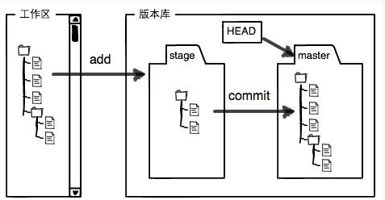
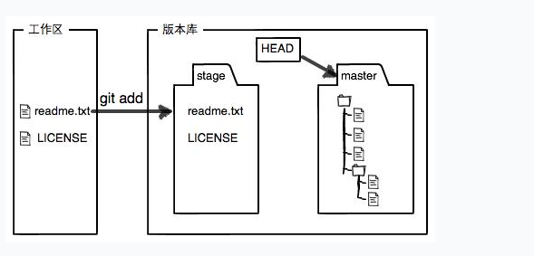
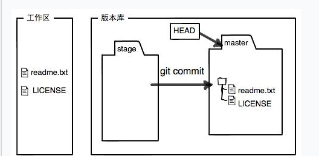

# 安装git

```
$ git #查看有无git
```

```
sudo apt-get install git
```

# 创建版本库

```
$ git init
```

# 添加文件到版本库

```
$ git add readme.txt
$ git add --all #添加所有
```

```
$ git commit -m "wrote a readme file"  #提交，并且添加注释
```

# 版本管理

```
$ git status  #查看当前版本状态（add状态）
```

```
$ git diff readme.txt   #查看文件被修改了什么
```

# 版本回退

```
$ git log  #查看历史修改（commit状态）
```

```
$ git reset --hard HEAD^  #回到上个版本的提交状态
```

首先，Git必须知道当前版本是哪个版本，在Git中，用`HEAD`表示当前版本，也就是最新的提交`1094adb...`（注意我的提交ID和你的肯定不一样），上一个版本就是`HEAD^`，上上一个版本就是`HEAD^^`，当然往上100个版本写100个`^`比较容易数不过来，所以写成`HEAD~100`。

```
$ git reset --hard 1094a #回到具体某个版本
```

```
$ git reflog  #查看命令历史，即附近所有版本
```

# 名词解释

工作区：working directory——电脑里在编辑的

版本库：repository（git的版本库就是文件里的.git文件）







```
$ git diff HEAD -- readme.txt  #查看工作区和版本库里最新版本的区别
```

# 撤销修改

```
$ git checkout -- readme.txt #让工作区恢复到版本库/暂存区的状态（如果已经add了）
```

```
$ git reset HEAD readme.txt #把暂存区的修改撤销
```

# 删除文件

```
$ git rm test.txt  #接下来要从版本库删除
rm 'test.txt'

$ git commit -m "remove test.txt"   #同时提交
```

# 创建SSH Key

```
$ ssh-keygen -t rsa -C "youremail@example.com"
```

找到.ssh里的id_rsa.pub公钥，打开github添加Key

# 创建远程库

1.将本地仓库关联到github上

```
$ git remote add origin git@github.com:michaelliao/learngit.git
```

2.将本地仓库的内容推送到远程（第一次）

```
$ git push -u origin master  #加u可以让本地和远程master分支关联
```

# 之后只需要本地push就可以了

```
$ git push origin master
```

# 删除远程库

```
$ git remote -v #查看远程库信息
```

```
$ git remote rm origin #根据名字删除绑定关系（真正文件要到github删除）
```

